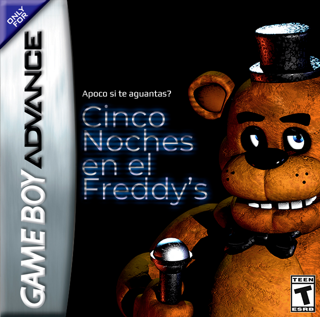
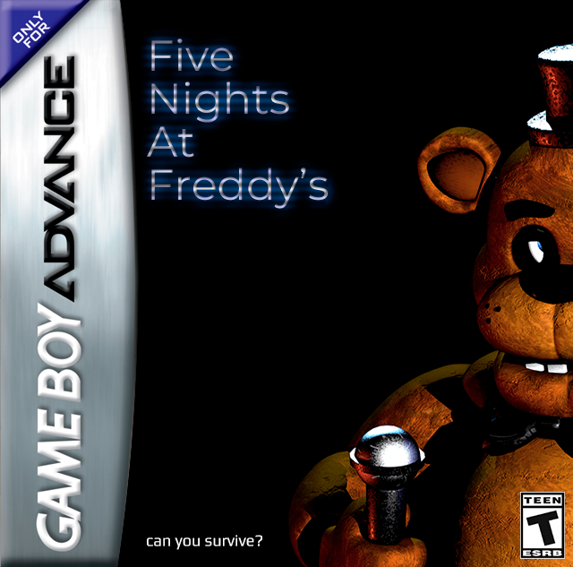
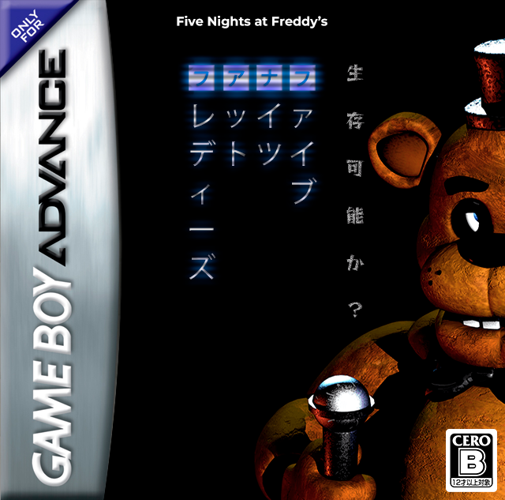

# Five Nights at Freddy's GBA

<p align="center">
  
  
  
</p>

> Demake de *Five Nights at Freddy's* para Game Boy Advance, desarrollado en C++ con el framework [Butano](https://github.com/GValiente/butano).
> Proyecto de **Felip Games Studio** — en desarrollo activo.

---

## Descripción

Port/demake fiel al original de Scott Cawthon para hardware GBA (240×160, 60 FPS). El juego reproduce la mecánica central de vigilancia nocturna: gestionar energía, puertas y luces mientras cuatro animatrónicos avanzan por el mapa de cámaras intentando llegar a la oficina.

---

## Estado del proyecto

| Módulo | Estado |
|--------|--------|
| Animatrónicos principales (Bonnie, Chica, Foxy, Freddy) | ✅ Completo |
| Sistema de energía con drenaje por noche y multiplicadores | ✅ Completo |
| Noches 1–6 con tabla de dificultad AI | ✅ Completo |
| Noche Personalizada (niveles 0–20 por animatrónico) | ✅ Completo |
| Oficina con scroll horizontal izquierda/centro/derecha | ✅ Completo |
| Menú principal con efectos de fondo, flicker y ruido estático | ✅ Completo |
| Pantalla de intro (logo Felip Games Studio) | ✅ Completo |
| Pantalla de periódico | ✅ Completo |
| Pantallas de fin de noche (Win / Game Over) | ✅ Completo |
| HUD (energía, barra de uso, hora, número de noche) | ✅ Completo |
| Sistema de guardado SRAM con checksum XOR | ✅ Completo |
| Transición Fade (negro ↔ pantalla) | ✅ Completo |
| Audio (.it tracks vía MaxMod) | ✅ Completo |
| Sistema de cámaras (mapa + vista interactiva) | 🚧 WIP — estructura vacía |
| Puertas y luces renderizadas en la oficina | 🚧 WIP — headers stub |
| Golden Freddy | 🚧 WIP — placeholder vacío |
| Audio Manager (capa de abstracción de sonido) | 🚧 WIP — vacío |
| Cola de eventos (`event_queue.h`) | 🚧 WIP — vacío |
| Sistema de progresión/logros (`progression.h`) | 🚧 WIP — vacío |

---

## Controles

| Botón | Acción |
|-------|--------|
| ← / → | Mirar a la izquierda / derecha de la oficina |
| **A** | Abrir / cerrar cámaras |
| **B** (mantener) | Encender luz del pasillo (según dirección actual) |
| **L** | Cerrar / abrir puerta izquierda |
| **R** | Cerrar / abrir puerta derecha |
| **Start / A** (intro) | Saltar intro |

---

## Estructura del proyecto

```bash
src/
├── main.cpp                        # Entry point: init GBA, screen manager, game loop
├── game_state.h                    # Enum GameState (legado, reemplazado por Screen)
│
├── core/
│   ├── clock.h / .cpp              # Reloj de noche: 12 AM → 6 AM (frames → horas)
│   ├── power.h / .cpp              # Drenaje de energía por noche con multiplicadores
│   ├── rng.h / .cpp                # RNG simple (LCG con seed configurable)
│   ├── game_context.h              # Struct compartido por todos los sistemas (snapshot del estado)
│   ├── game_settings.h             # Niveles AI por animatrónico (0–20)
│   ├── event_queue.h               # 🚧 WIP
│   └── progression.h               # 🚧 WIP
│
├── animatronics/
│   ├── animatronic.h / .cpp        # Clase base genérica (prototipo simplificado)
│   ├── bonnie.h / .cpp             # Ruta izquierda: Show Stage → Left Door
│   ├── chica.h / .cpp              # Ruta derecha: Show Stage → Right Door
│   ├── foxy.h / .cpp               # Pirate Cove: fases + sprint hacia Left Door
│   ├── freddy.h / .cpp             # Ruta derecha + modo Power Out (Toreador March)
│   └── golden_freddy.h             # 🚧 WIP (vacío)
│
├── game/
│   └── game.h / .cpp               # Loop de juego: input, reloj, energía, animatrónicos, HUD
│
├── save/
│   └── save_data.h / .cpp          # SRAM GBA (0x0E000000), checksum XOR, flags
│
├── effects/
│   └── static_noise.h / .cpp       # Efecto de ruido estático (sprites white_noise 1–8)
│
├── audio/
│   └── audio_manager.h / .cpp      # 🚧 WIP (vacío)
│
└── screens/
    ├── screen_manager.h / .cpp     # Máquina de estados de pantallas (register/change/update)
    ├── intro_screen.h / .cpp       # Logo Felip Games Studio + música, skip con A/Start
    ├── newspaper_screen.h / .cpp   # Periódico entre intro y noche 1, skip con A
    │
    ├── menu/
    │   ├── main_menu.h / .cpp      # Menú principal: continue/new game/night6/custom + efectos
    │   └── custom_menu.h / .cpp    # Noche personalizada: niveles 0–20 por animatrónico
    │
    ├── office/
    │   ├── office_screen.h / .cpp  # Fondo de oficina con scroll suavizado
    │   ├── doors.h                 # 🚧 WIP — stub
    │   └── lights.h                # 🚧 WIP — stub
    │
    ├── cameras/
    │   ├── camera_screen.h / .cpp  # 🚧 WIP — estructura definida, sin implementación
    │   └── camera_map.h            # 🚧 WIP (vacío)
    │
    ├── end/
    │   ├── gameover_screen.h / .cpp  # Pantalla de Game Over → vuelve al menú
    │   └── win_screen.h / .cpp       # Pantalla de victoria (6 AM) → vuelve al menú
    │
    └── transitions/
        └── fade.h / .cpp           # Fade negro ↔ pantalla usando bn::bg/sprite_palettes
```

---

## Mecánicas implementadas

### Animatrónicos

Cada animatrónico tiene su propia clase con ruta, temporizadores y RNG de seed única. Los valores reproducen los del JS original:

**Bonnie** — ruta izquierda (Show Stage → Backstage → Dining → West Hall → Supply Closet → Left Door). Intervalo de movimiento: 298 frames (~4.97 s).

**Chica** — ruta derecha (Show Stage → Dining → Restrooms → Kitchen [solo audio] → East Hall → East Corner → Right Door). Intervalo: 299 frames.

**Foxy** — sistema de fases (cortina cerrada → peeking 1/2 → abierta) + sprint de 25 frames hacia la puerta izquierda. Si la puerta está cerrada al llegar, drena energía (`5 + ai_level/2`). Intervalo de chequeo de fase: 720 frames (12 s).

**Freddy** — ruta derecha; **solo se mueve si no lo están mirando en cámara**. Modo especial Power Out: cuando la energía llega a 0, espera entre 10 y 20 s (sorteados aleatoriamente) antes de causar Game Over.

### Sistema de energía

Drenaje base por noche (frames por tick de −1%):

| Noche | Frames/tick | Equivalente |
|-------|-------------|-------------|
| 1     | 578         | ~9.6 s      |
| 2     | 480         | 8.0 s       |
| 3     | 432         | 7.2 s       |
| 4–6   | 384         | 6.4 s       |

Multiplicadores según items activos (puertas, luces, cámaras): ×1.0 / ×1.6 / ×2.8 / ×4.6 / ×8.0 — representados como fracciones enteras para evitar float en GBA.

### Tabla de AI por noche

| Noche | Freddy | Bonnie | Chica | Foxy |
|-------|--------|--------|-------|------|
| 1 | 0 | 0 | 0 | 0 |
| 2 | 0 | 3 | 1 | 1 |
| 3 | 1 | 0 | 5 | 2 |
| 4 | 1 | 2 | 4 | 6 |
| 5 | 3 | 5 | 7 | 5 |
| 6 | 4 | 10 | 12 | 16 |

### Guardado (SRAM)

Escritura directa en SRAM GBA en `0x0E000000`. Estructura de 4 bytes: `max_night`, `stars` (0–3), `flags` (`FLAG_HAS_SAVE`, `FLAG_CUSTOM_UNLOCK`) y `checksum` (XOR de los tres primeros campos). La Custom Night se desbloquea al activar `FLAG_CUSTOM_UNLOCK` en el save.

---

## Assets

### Gráficos (`graphics/`)

Archivos `.bmp` + `.json` de metadata Butano:

- Fondos de menú: `menu1–4.bmp` (ciclo con flicker aleatorio en el main menu)
- `office.bmp` — fondo panorámico de la oficina (scroll horizontal ±40 px)
- `gameover.bmp`, `newspaper.bmp`, `felip_games_studio.bmp`
- Sprites: `star_8x8`, `star_16x16`, `usage_bar`, `white_noise1–8`
- Fuentes: fixed 8×8 / 8×16 / 32×64 y variable 8×8 / 8×16 / 16×16 (azul, rojo, amarillo)

### Audio (`audio/`)

Módulos Impulse Tracker (`.it`) procesados por MaxMod:

| Archivo | Uso |
|---------|-----|
| `felip_games_studio.it` | Jingle de intro del estudio |
| `fnaf_intro.it` | Música del menú de noche personalizada |
| `darkness.it` | Música del menú principal |
| `ambience2.it` | Ambiente de la oficina durante la partida |
| `gracefully_into_the_abyss.it` | Preparada, sin asignar aún |

---

## Dependencias y compilación

- **Framework:** [Butano](https://github.com/GValiente/butano) (cabeceras `bn_*`)
- **Toolchain:** devkitARM (`arm-none-eabi-g++`)
- **Audio:** MaxMod (integrado en Butano)
- **Build:** Makefile estándar de Butano

```bash
# Requiere devkitPro instalado y $DEVKITPRO configurado
make

# Salida: FNAF.gba
```

El `.gba` generado puede ejecutarse en mGBA (recomendado) o en hardware real con flashcart.

---

## Próximos pasos (WIP prioritario)

1. **Sistema de cámaras** — implementar `CameraScreen` y `camera_map.h`: navegación entre cámaras y renderizado de la posición de cada animatrónico.
2. **Puertas y luces renderizadas** — completar `Doors` y `Lights` para mostrar su estado visualmente en la oficina.
3. **Audio Manager** — capa de abstracción sobre MaxMod para gestionar transiciones de música y efectos de sonido (Toreador March del Power Out de Freddy, jumpscares, etc.).
4. **Golden Freddy** — aparición aleatoria como easter egg al mirar a cámara 1A bajo condiciones especiales.
5. **Sistema de progresión** — guardar estrellas y desbloquear la Custom Night al completar la noche 5.
6. **Cola de eventos** — desacoplar la comunicación entre animatrónicos, juego y audio mediante `event_queue.h`.

---

## Créditos

Desarrollado por **Felip Games Studio**.
*Five Nights at Freddy's* es propiedad de Scott Cawthon / Steel Wool Studios. Este es un proyecto de fan sin fines comerciales.
